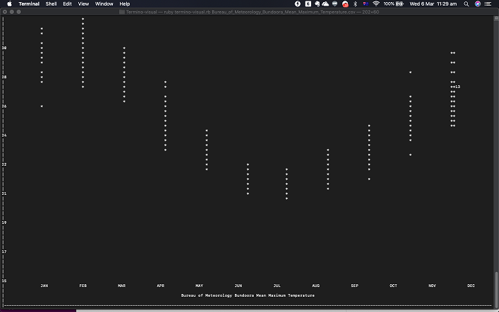
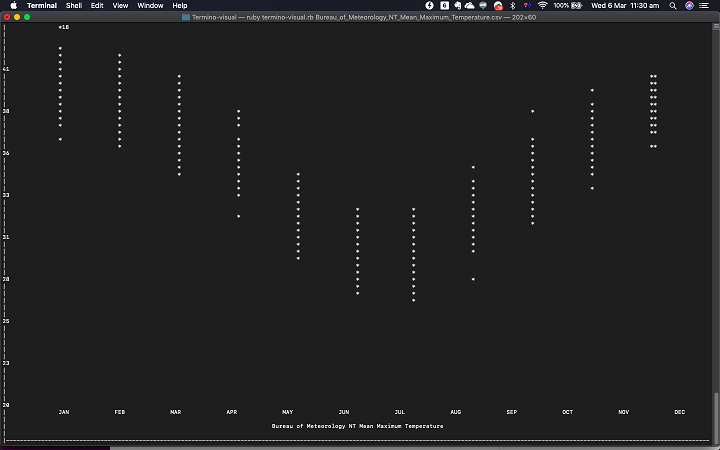
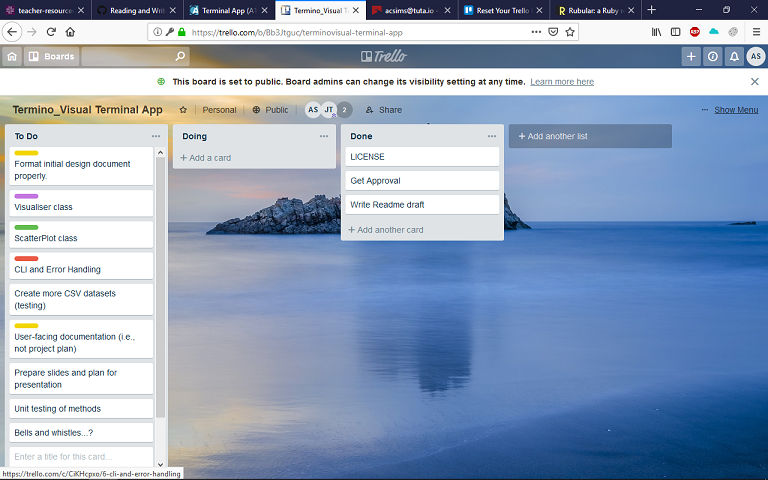
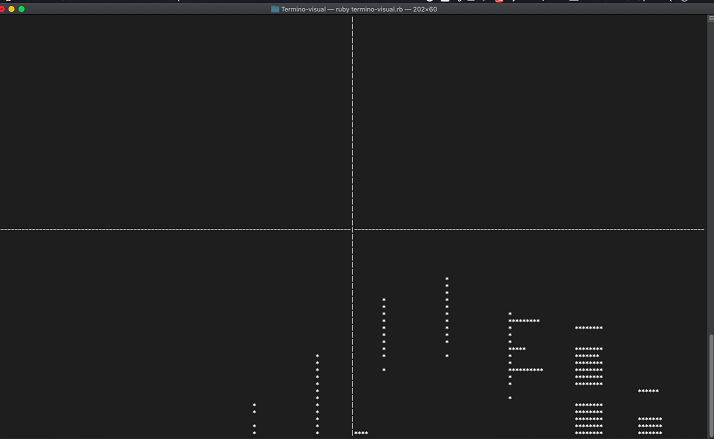
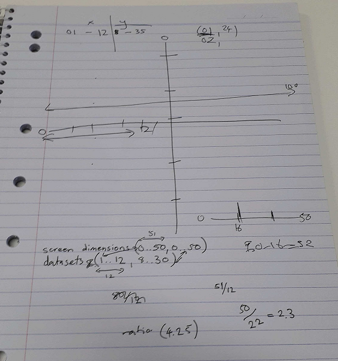
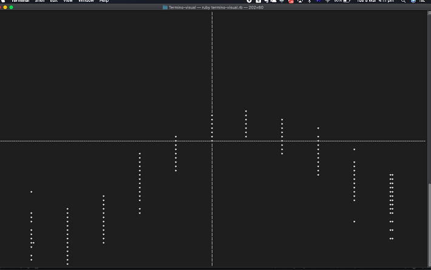
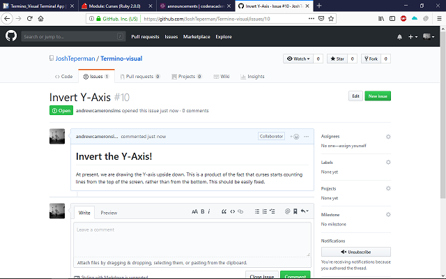
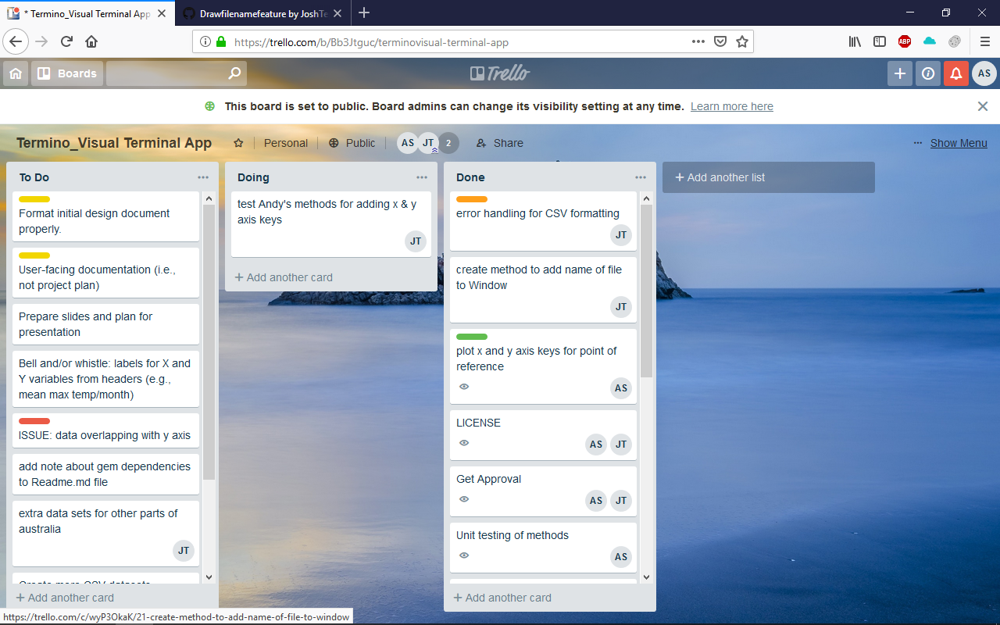
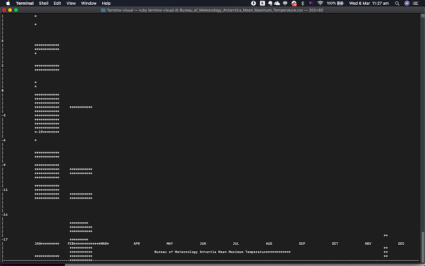

# Termino-Visual: CLI for generating scatterplots from CSV data
### Version 0.1
## Purpose
This is a command line application which accepts .csv files as arguments at the command line and renders  scatterplots at the command line. For the present iteration, these .csv files must be formatted so that they consist only of 2 columns, and without headers. More sophisticated functionality will be added in later versions.

## Installation
For usage of Termino-Visual, the following gemfiles must be installed on your system:
* [Curses](https://github.com/ruby/curses)
* [Descriptive Statistics](https://github.com/ruby/curses)

## Usage
Termino-Visual is written in Ruby 2.5.1 and therefore requires the Ruby interpreter to be installed on your machine. Instructions on how to do this can be found [here](https://www.ruby-lang.org/en/documentation/installation/).

When both Ruby and Termino-Visual is installed, navigate to the correct folder and run it by typing
`ruby termino-visual.rb` followed by the name of your .csv file. This will generate a scatterplot with labelled x and y axes and a title that is inferred from the filename. Following these steps for the sample datasets that we include in our repo yields the following results:

## Design and Planning Process

### Brainstorming
We wanted to create an application to visualise data in the terminal. In the early stages of brainstorming, it was not clear exactly what the scope of this project would be. One of us had an antecedent project in the works concerning histograms, but was convinced by the other that it would be more prudent to build the first iteration of the application to render scatterplots. To draw scatterplots involves rendering a single character to the screen for each datapoint, where rendering histograms would require processing the data into bins that are rendered to different heights at constant widths, and would therefore be more complex. We settled on the scatterplot generator, and once we received approval we got to planning.

### Planning program structure
We thought it made most sense to write the program to incorporate three distinct components or stages of processing. These would involve:
1. Accepting and parsing a .csv file as an argument at command line, while handling potential errors.
2. Processing the contents of this file into a form appropriate for visualisation.
3. Doing the actual visualisation; i.e., rendering a scatterplot to the user's screen.

This program looked as though it would have a serial structure, where the data would flow from one component to the other without doubling back. Given this, we decided to pursue an object-oriented framework for building the application, where each of these processing stages would be implemented as classes. Each object of the class would contain the dataset as an attribute, and would be transformed appropriately for the next stage of processing using instance classes. That way, we could break up the required operations into many smaller methods without sacrificing readability, and it would make it easier for us to allocate work between us (i.e., we each work on one class).

Finally, we decided on an independent set of methods to accept and parse the file when the application loads, a Scatterplot object which would be initialised with the data when loaded, and which would transform that data into a form appropriate to visualisation--and finally, a Visualiser class that would call build on the Curses methods in order to render the data and associated labelling to screen. That makes these components:

1. __Error Handling__ : handles errors and parses .csv file
2. __Scatterplot__ : transforms data into scatterplot format
3. __Visualiser__ : renders plot to screen

### Implementing each component
The implementation of the error handling was straightforward and was completed quickly. The problems associated with the two classes were less generic and we encountered some obstacles on the way to our present application. 

Firstly, it was necessary for us to scale the dataset to print appropriately on any number of typical screens. It took a little while to get this right. Initially, we attempted to use the difference between the dataset-range and the screensize-range to produce a ratio by which to multiple each coordinate to fit on the user screen. However, we found the result unsatisfactory:

Obviously the algorithm for doing this required better planning, and so we sketched out the problem on paper in order to think through it more carefully. In doing this we were able to see that it would be better to use the max values of each dataset in place of the ranges.

Secondly, we were confused when our testing datasets seemed to show maximum temperature spiking in the middle of year--the opposite of what we expected given that the measurement took place in the southern hemisphere.

We found that this was due to the fact that Curses counts lines from the top of the screen, meaning the 0 is at the top of the screen and `Curses.lines` is at the bottom. This was fixed by inverting the y-coordinate at which the datapoint was rendered to screen.

Once these issues were resolved we found ourselves getting through our Trello cards much more quickly.

## Testing
We adopted a manual and ad-hoc testing process. As methods and classes were completed, we would try to call them on a .csv that we had downloaded from the Australian Bureau of Meterology and formatted into a form appropriate to our application. We also did the same thing on a smaller scale. For example, we created an array of bad filenames to iterate over and pass to our error-handling methods at the beginning of the program. Some record of this can be found in `/tests`. We also tested the program on different PCs to test for compatibility across machines.

## Known issues
We suspect that both of the issues below have to do with eccentricities associated with the Curses gem, and we are looking into alternatives for rendering to screen that are "native" to Ruby.
* Regionalisation: currently, there is an issue correctly rendering negative temperatures, which may result in problems for users in parts of the northern hemisphere or extreme southern hemisphere. We have included the Antarctica dataset so that this bug can be reproduced easily.

* Some filenames do not render correctly as titles for the plots, and are missing letters, particularly the letter 'c' tends to disappear from the titles for some reason (see title in above screenshot).

## Ethical issues
Termino-visual may not be appropriate for the plotting of sensitive data. However, given that it works in the terminal, it is computationally inexpensive and therefore environmentally friendly way of rendering plots when high resolution is not a priority.

## Extensibility and Improvements
Without taking bugs into account, we think that the application could be extended and improved along the following lines.
* There exist APIs for pulling data from various sources. An obvious extension would be to allow reading of data from these sources rather than solely from files on the local machine.
* At present the .csv file is only accepted by the application if it is properly formatted. The software would be greatly improved if it could handle a variety of different formats (e.g., more than 2 columns, and headers) and prompt the user for more information to resolve ambiguity. For example, if the application is based a .csv with 5 columns that have headers, it would be nice if the user was asked which of these columns were to be plotted on the x and y axes.
* Coloured plots would improve the aesthetics of the software.